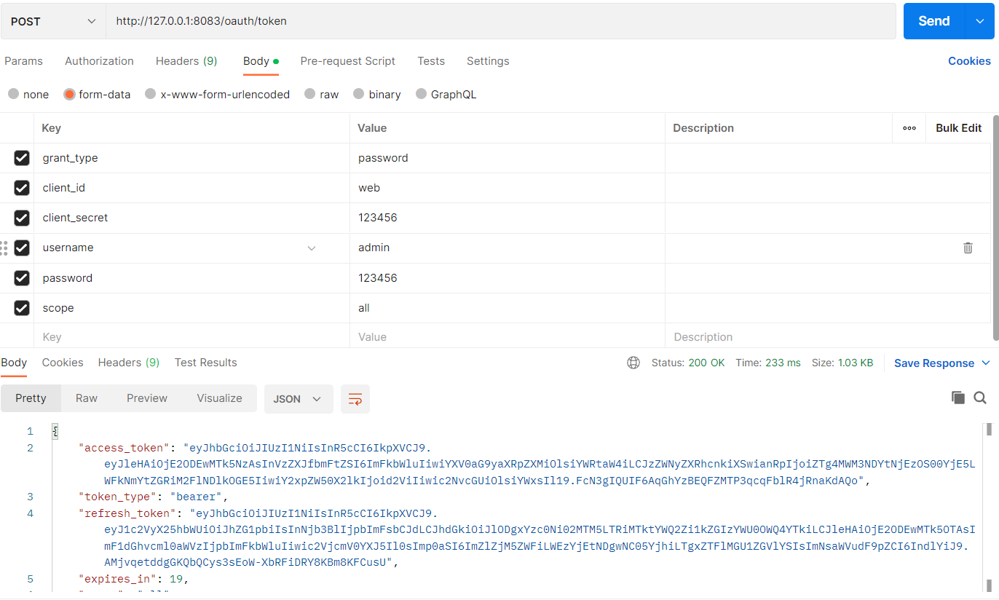
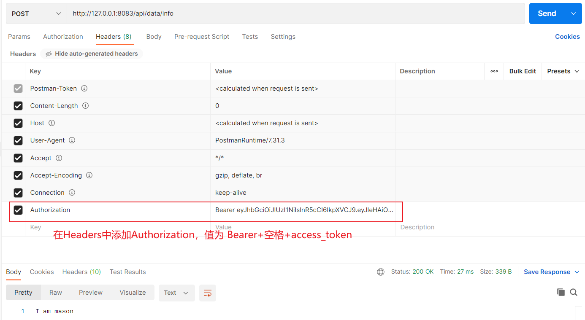
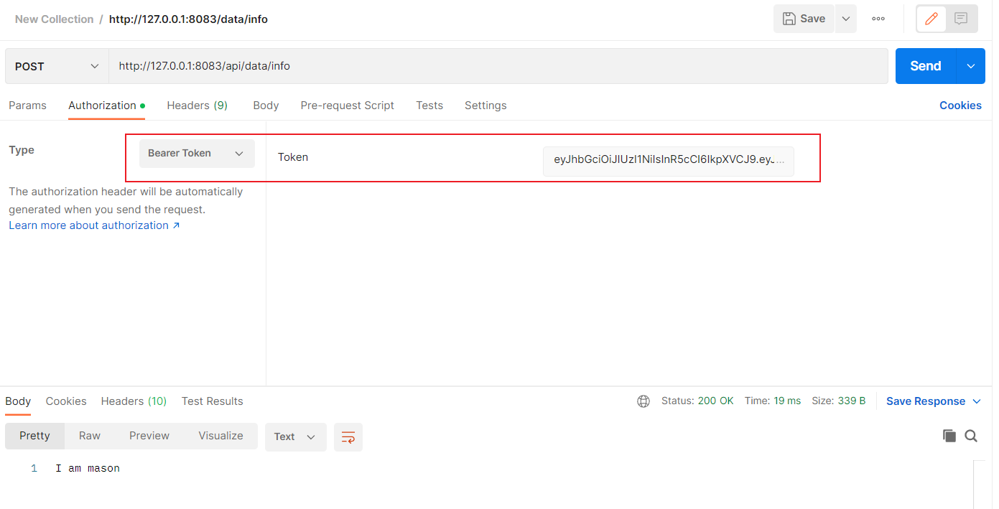

# Spring Cloud Gateway和Spring Cloud OAuth2结合

## 1 本文的解决思路

本文的解决思路：oauth-gateway和oauth-server连接的同一个redis数据库，Gateway从redis数据库直接读取token，进行鉴权。

其他的解决思路：oauth-gateway通过RSA非对称加密算法连接oauth-server的鉴权服务；

第二种方法相对比较麻烦一些；

**oauth项目组成**

| 服务          | 端口号 | 备注         |
| ------------- | ------ | ------------ |
| oauth-server  | 81     | 授权服务     |
| oauth-api     | 82     | 提供数据服务 |
| oauth-gateway | 83     | 网关配置     |

## 2 测试

### 2.1 请求oauth-server的token

### 2.2 通过oauth-gateway请求oauth-server的token

### 2.3  通过oauth-gateway请求oauth-api的data

**第一种方法**

**第二种方法**

